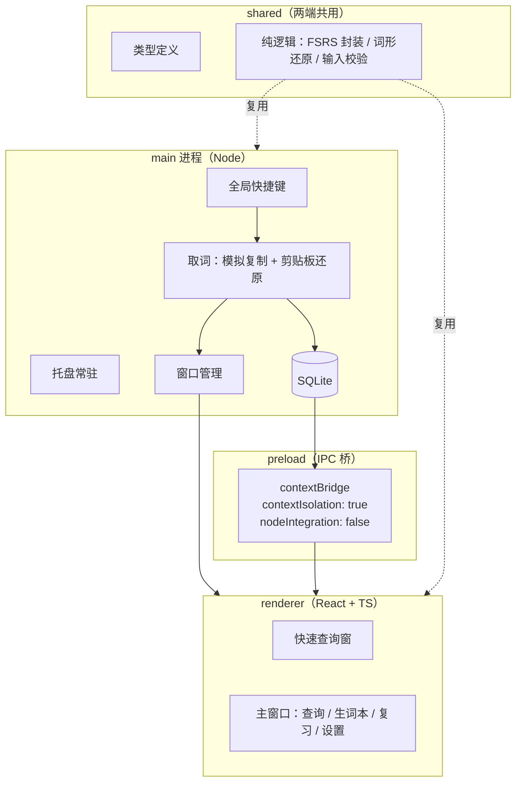

# WordBox 项目规划

> 个人英语生词工具：一个随时能唤起的离线词典 + 一个只装你真正遇到过的词的生词本 + 一套可复习的卡片。
> 版本：v0.2.1（规划定稿，开工前校验版）　日期：2026-10-04

---

## 0. 一句话定位

**WordBox 是一个常驻在 Windows 上的桌面应用**：读书或看网页时选中一个词、按一下快捷键，立刻看到释义；
这个词会被记进查询历史；如果判断它值得背，一个动作把它变成一张按记忆曲线复习的卡片。

面向单一用户（作者本人），代码开源在 GitHub。

---

## 1. 需求

### 1.1 真实场景

| 编号 | 场景 | 期望 |
|---|---|---|
| S1 | 用 Readest 读 EPUB，遇到生词挡住句子理解 | 选中词 + 一个快捷键，释义立刻出现，不打断阅读 |
| S2 | 浏览器里读英文页面 | 同上，任何程序里都要能用 |
| S3 | 事后回顾 | 看得到"我最近查过哪些词"，发现反复查的 |
| S4 | 决定要背 | 把词加入生词本，可以补备注、打标签 |
| S5 | 想来就复习一下 | 打开就有到期卡片，随时停，没有打卡压力 |
| S6 | 想主动查一个词 | 快捷键唤出查询窗，手动输入也能查 |
| S7 | 一整句读不懂，不只是某个词不认识 | 选中整句按快捷键，弹出的句子切成可点的词，点哪个查哪个，语境随词保存 |

### 1.2 用户故事

- US-1 我在**任何能选中文本的程序**里（阅读器、浏览器、PDF、Office……）选中英文词，按查词快捷键就能看到释义，不离开当前界面。
- US-2 当我卡在一整句上时，我选中整句按查句快捷键，在弹出的句子里点那个不懂的词，看它在**这句话里**是什么意思。
- US-3 我查词**不会**自动变成生词卡片——查得多、记得少，这两件事必须分开。
- US-4 我能看到查询历史，并且知道哪些词我查了很多次。
- US-5 我把一个词加入生词本时，可以顺手改词条、写备注、打标签，**当时的那句话会自动带上**。
- US-6 我复习时看到的是"词 + 我遇到它的那句话"，翻面看释义，然后评"忘了/有点难/记得/太简单"。
- US-7 我的所有数据都在本地，随时能一键导出，不依赖任何在线服务。
- US-8 断网也能查词和复习（本地全量词典）。

### 1.3 功能分级

**P0 —— MVP**

| 编号 | 功能 | 说明 |
|---|---|---|
| F-01 | 离线词典查询 | 全量本地词库，毫秒级，无需网络 |
| F-02 | 两级释义 | 简洁（音标 + 词性 + 核心义项）／详细（全部义项 + 英文释义 + 词形变化 + 考试标签 + 词频） |
| F-03 | 词形还原 | 查 running 提示原形 run；收录时存原形 |
| F-04 | 取词：程序无关 | 不绑定任何阅读器，只要目标程序支持复制选中文本就能用 |
| F-05 | 查词快捷键 | 选中一个词或固定短语，按键直接出释义（默认 Ctrl+Alt+D，可改） |
| F-06 | 查句快捷键 | 选中整句或整段弹出可点的句子；点词即查，Shift+点或拖选可选中多个词组成短语（默认 Ctrl+Alt+S，可改） |
| F-07 | 语境留存 | 句模式下把原句随词保存，复习与详情页都显示 |
| F-08 | 查询历史 | 自动记录每次查询，本地，可查看、可搜索 |
| F-09 | 生词本 | 显式加入（可编辑、加标签、写备注），列表、搜索、筛选、删除 |
| F-10 | 卡片复习 | FSRS 调度、翻卡、4 档评分、随时停 |
| F-11 | 本地存储 | SQLite；导出/导入 JSON 备份 |
| F-12 | 发音 | 系统语音合成（离线，不联网） |
| F-13 | 托盘常驻 | 关窗口不退出，快捷键始终可用 |

**P1 —— 第二版**

| 编号 | 功能 | 说明 |
|---|---|---|
| F-14 | 拼写模式 | 复习时要求拼出单词，作为可选开关 |
| F-15 | 历史批量提升 | 从查询历史里挑词批量加入生词本 |
| F-16 | 轻量统计 | 生词总量、到期量、复习量；不做打卡压力和排行榜 |
| F-17 | 标签体系 | 自定义标签、按来源筛选 |
| F-18 | 查询窗增强 | 会话历史、上一个/下一个、直接跳到详细释义 |

**P2 —— 有余力再说**

| 编号 | 功能 | 说明 |
|---|---|---|
| F-19 | 剪贴板监听 | **默认关闭**的可选项，见 4.5 |
| F-20 | AI 语境释义 | 有了句模式留下的原句，可以让 LLM 解释"这个词在这个句子里是什么意思" |
| F-21 | 外部导入 | Anki / CSV / 其他生词本 |
| F-22 | 手机端 | 导出 JSON 到一个纯静态页面复习（见 D9） |

### 1.4 非功能需求

| 维度 | 指标 |
|---|---|
| 查词速度 | 从按键到释义显示 ≤ 300 ms（含取词延迟） |
| 离线 | 查词、复习、加词 100% 离线可用 |
| 安装包 | Electron 约 150 MB + 词库，预计 250 MB 量级，个人使用可接受 |
| 资源占用 | 常驻后台内存尽量低；托盘状态不做无谓轮询 |
| 数据安全 | 全本地；导出即完备备份；不依赖任何账号 |
| 隐私 | 零埋点；不联网（发音用系统 TTS）；AI 功能为显式触发且自带 Key |
| 可用性 | 快捷键唤出 → 看完 → Esc 关闭，全程键盘可完成 |

### 1.5 非目标（明确不做）

- 不做 EPUB / PDF 阅读器，不替代 Readest
- 不做浏览器扩展
- 第一版不做手机端
- 不做在线词典服务端，不爬取、不再分发受版权保护的词典内容
- 不做**外部**例句抓取，也不用 AI 生成例句（但句模式下你选中的原句会被保存下来，见 D13）
- 不做社交、排行榜、班级、打卡
- 不追求"背完词表"，只服务于你真实遇到过的词

---

## 2. 已确认的决策

这些是讨论中定下来的结论，同时记下被推翻的备选和理由——这部分以后写进 `docs/adr/`，是这个项目最有价值的文档之一。

| # | 决策 | 曾经的备选 | 结论理由 |
|---|---|---|---|
| D1 | **Electron 桌面应用** | PWA（v0.1 的原方案） | 需要全局快捷键、托盘常驻、本地 SQLite 全量词库，这些网页沙箱做不到；且开发只需一门语言 |
| D2 | **不做内置阅读器** | 内置 EPUB 阅读器 | 取词需求跨程序（Readest、浏览器、以后其他），做阅读器只覆盖一种场景，而且会牺牲现有阅读体验 |
| D3 | **全局快捷键 + 快速查询窗** | 剪贴板监听自动收录 | "复制 ≠ 想查词"，自动收录过于宽泛；显式动作才能准确表达意图 |
| D4 | **查询历史与生词本分离** | 查过即收录 | 查询高频、记录低频；绑在一起会灌满不想背的词 |
| D5 | **加入生词本是显式动作** | 自动收录 | 同上；且在查询窗里只是一个按键，成本极低 |
| D6 | **FSRS（`ts-fsrs`）** | SM-2 / 自研 | 成熟 TS 实现，同等记忆效果下复习量更少 |
| D7 | **ECDICT 全量离线词库** | 在线词典 API | 无额度、无 Key、无网络、隐私好；直接解决现有阅读软件翻译有额度限制的痛点 |
| D8 | **SQLite 双库** | IndexedDB / JSON 文件 | 桌面端可直连文件，查词毫秒级；备份=复制文件；只读词库与用户数据隔离，便于升级词库 |
| D9 | **第一版不做手机端** | PWA 天然多端 | 手机只用于偶尔复习，且 PC 为主；先做好桌面，之后再谈 |
| D10 | **不做浏览器扩展** | 扩展划词 | 全局快捷键已覆盖浏览器场景，多维护一个扩展不划算 |
| D11 | **不做外部例句抓取** | 爬取/生成例句 | 成本高、收益一般；改为只保存你自己选中的原句（D13），更真实也更便宜 |
| D12 | **取词程序无关** | 针对 Readest 定制 | 只依赖"目标程序支持复制选中文本"这一条，覆盖阅读器、浏览器、PDF、Office；终端等特例留兜底 |
| D13 | **两个快捷键：查词 / 查句** | 一个快捷键按内容自适应（v0.2 的做法） | 你按哪个键就说明你要做什么，不做猜测。少一类边界情况（`ubiquitous.` 到底算不算句子），也更好记 |
| D14 | **模拟复制降级为"加速路径"，剪贴板兜底成为一等公民** | 坚持"一个快捷键搞定一切"（v0.2 的做法） | M0 实测：卡巴斯基的行为检测拦掉了"隐藏进程 + 合成 Ctrl+C"这套组合——第一次放行，之后每次都拦。伪造键盘输入与恶意软件的行为同形，坚持它等于和安全软件长期拉锯。改为：快捷键先试模拟复制，失败即改读用户自己按 Ctrl+C 后的剪贴板，连续失败 3 次自动熔断以免反复弹拦截提示。代价是多按一次 Ctrl+C，换来零对抗与跨机器稳定 |

---

## 3. 架构

### 3.1 进程结构（Electron 三段式）



**为什么是这三段**：只有主进程有系统能力（快捷键、剪贴板、文件），渲染进程只管界面。
`contextIsolation: true` + `nodeIntegration: false` 是安全底线——界面代码永远不直接碰系统，只通过 preload 暴露的白名单接口调用。

**shared 层的意义**：FSRS 调度、词形还原、取词结果校验这些逻辑主进程和界面都可能用到，
写成纯函数放共享层，既两边复用，又能脱离 Electron 单独做单元测试。

### 3.2 分层与依赖方向

| 层 | 职责 | 硬性规则 |
|---|---|---|
| `renderer/features/` | 页面与用例编排（查询、生词本、复习、设置） | 通过 IPC 客户端访问能力，不直接碰 Node |
| `renderer/ui/` | 通用组件、样式 | 无业务逻辑 |
| `shared/domain/` | 实体、FSRS 封装、词形还原、取词校验、统计 | **纯函数、零 IO、零 Electron 依赖、可 100% 单测** |
| `main/services/` | 词典查询、取词、快捷键、托盘、导入导出 | 实现 `shared/domain` 定义的接口 |
| `main/data/` | SQLite 建库、迁移、Repository 实现 | 只被 services 调用 |

依赖方向永远是 `renderer → shared ← main`，主进程与渲染进程之间不允许直接互相引用。

### 3.3 目录结构

```
wordbox/
├─ README.md                   # 门面：定位 / 截图 / 安装 / 本地开发
├─ LICENSE                     # MIT
├─ .gitignore / .gitattributes / .editorconfig
├─ .npmrc                      # 包源与 Electron 二进制走国内镜像
├─ pnpm-workspace.yaml         # pnpm 11 的配置落脚点（依赖构建放行名单）
├─ package.json / electron.vite.config.ts / electron-builder.yml
├─ tsconfig.json / tsconfig.node.json / tsconfig.web.json
├─ eslint.config.mjs / .prettierrc.yaml / .prettierignore
├─ .vscode/                    # 推荐插件与调试配置
├─ build/                      # 打包图标（electron-builder 的 buildResources）
├─ docs/
│  ├─ PROJECT_PLAN.md
│  ├─ PROGRESS.md              # 进度记录：当前状态 / 会话日志 / 阻塞项
│  ├─ DATA_MODEL.md
│  ├─ IDEAS.md                 # 延后的想法，不插队
│  └─ adr/                     # 第 2 节每个决策一条
├─ scripts/
│  ├─ build_dict.py            # ECDICT CSV → SQLite（含索引、词形反查）
│  └─ README.md                # 数据管线：怎么下载、怎么复现
├─ resources/
│  ├─ icon.png                 # 窗口图标
│  └─ ecdict.db                # 预处理产物（只读词库，M1 生成）
├─ src/
│  ├─ main/
│  │  ├─ index.ts              # 应用生命周期、IPC 注册
│  │  ├─ windows/              # 主窗口、快速查询窗
│  │  ├─ services/             # grab（取词）/ hotkey（快捷键），后续 dictionary、tray、backup
│  │  └─ data/                 # sqlite 连接、schema、repository（M2）
│  ├─ preload/                 # index.ts + index.d.ts：白名单 IPC 接口
│  ├─ shared/
│  │  ├─ domain/               # 纯逻辑：grab-guard，后续 lemma / tokenize / srs / stats
│  │  ├─ types.ts              # 实体类型（M2）
│  │  └─ ipc-contract.ts       # 通道名与载荷类型（两端共用，改错会编译失败）
│  └─ renderer/
│     ├─ index.html
│     └─ src/                  # 界面代码根目录（electron-vite 约定）
│        ├─ App.tsx / main.tsx / assets/
│        ├─ features/          # lookup / vocabulary / review / settings（后续）
│        ├─ ui/                # 通用组件与样式（后续）
│        └─ app/               # 路由、布局、主题（后续）
├─ tests/
│  ├─ unit/                    # Vitest：纯逻辑与数据层
│  └─ e2e/                     # Playwright + Electron
└─ .github/workflows/          # ci.yml / release.yml
```

### 3.4 数据模型

两个数据库，职责完全不同。

**`ecdict.db`（只读，可整体替换升级）**

```sql
CREATE TABLE dict (
  word        TEXT PRIMARY KEY,
  phonetic    TEXT,      -- 音标
  translation TEXT,      -- 中文释义（多行，含词性）
  definition  TEXT,      -- 英文释义
  pos         TEXT,      -- 词性
  collins     INTEGER,   -- 柯林斯星级
  oxford      INTEGER,   -- 牛津3000
  tag         TEXT,      -- cet4/cet6/ky/toefl/ielts/gre
  bnc         INTEGER,   -- 词频
  frq         INTEGER,
  exchange    TEXT,      -- 词形变化（p/d/i/3/r/t/s）
  detail      TEXT
);
CREATE INDEX idx_dict_lower ON dict(lower(word));

-- 词形反查：running → run
CREATE TABLE lemma (
  form  TEXT PRIMARY KEY,
  lemma TEXT NOT NULL
);
```

**`user.db`（可写，你的全部数据）**

```ts
interface Word {
  id: string;                 // uuid v7，时间有序
  lemma: string;              // 原形
  display: string;            // 你当初选中的形态
  phoneticUk?: string;
  phoneticUs?: string;
  // 以下是加入时的释义快照，不随词库升级而变
  briefZh: string;            // 简洁释义（中文）
  detailZh?: string;          // 详细释义（中文，多行）
  definitionEn?: string;
  exchange?: string;          // 词形变化
  examTags?: string;          // 词库给的考试标签（cet4/cet6/ky/toefl/ielts/gre）
  userTags?: string[];        // 你自己打的标签
  sensesJson?: string;        // 完整义项快照
  note?: string;              // 你写的备注
  source?: string;            // 出处（书名 / 网站）
  contexts: ContextEntry[];   // 你遇到它的那些句子（JSON 数组）
  status: 'active' | 'archived';
  createdAt: number;
  updatedAt: number;
  deleted?: number;           // 软删除
}

interface ContextEntry {
  sentence: string;           // 句模式下你选中的原句
  source?: string;            // 当时从哪个程序抓的
  capturedAt: number;
}

interface Lookup {
  id: string;
  term: string;               // 你实际查的形态
  lemma: string;              // 还原后的原形
  lookedUpAt: number;
  sourceApp?: string;         // 从哪个程序查的（尽力而为）
  promotedWordId?: string;    // 已加入生词本则指向 Word.id
}

interface Card {
  id: string;
  wordId: string;
  due: number;
  stability: number;
  difficulty: number;
  elapsedDays: number;
  scheduledDays: number;
  reps: number;
  lapses: number;
  state: 'New' | 'Learning' | 'Review' | 'Relearning';
  lastReview?: number;
  suspended?: boolean;
}

interface ReviewLog {
  id: string;
  cardId: string;
  rating: 1 | 2 | 3 | 4;      // Again / Hard / Good / Easy
  reviewedAt: number;
  durationMs: number;
  stateBefore: Card['state'];
  stateAfter: Card['state'];
}
```

**四个设计要点**

1. **释义快照**。`Word` 里存的是加入那一刻的释义副本，不是外键。这样升级词库不会改动已背过的卡片，
   而且导出数据自带可读内容，不依赖词库文件。
2. **语境是数组**。`Word.contexts` 允许同一个词在不同句子里被遇到多次，MVP 只追加不管理。
   将来要做"按语境复习"（同一个词的不同用法分开练）时拆成独立表即可，数据结构不用改。
3. **`Lookup.promotedWordId`** 是连接"查询历史"与"生词本"的唯一纽带，也是 F-15 批量提升的基础。
   "这个词我查了三次"这类洞察就是从这张表算出来的。
4. **软删除 + 时间戳**。为将来的同步和误删留后路，成本几乎为零。

### 3.5 三条核心数据流

**A. 查询流（最高频）**

```
查词：选中一个词  → Ctrl+Alt+D
查句：选中一整句  → Ctrl+Alt+S
  → 主进程：保存当前剪贴板内容
  → 在你当前程序里模拟 Ctrl+C（此时焦点未变）
  → 等 ~120 ms，读剪贴板
  → 校验：内容变了才认；没变 / 为空 / 不含字母 → 视为"无选区"，弹空输入窗
  → 恢复原剪贴板内容
  → 清理：去掉首尾空白与标点，统一弯引号、破折号
  → 按你按下的那个键决定行为，不做猜测：
      · 查词 → 整体当一个词条 → 词形还原 → 查 ecdict.db → 直接显示释义
      · 查句 → 按句切分、再分词 → 显示原文，每个词可点
                点一个词 / 选中多个词组成短语 → 查 → 在原文下方显示释义
  → 两种情况都写入 lookups（查句记你真正点开的那个词）
```

**B. 收录流（低频、显式）**

```
在快速查询窗或词条详情里 → 按"加入生词本"
  → 可编辑：词条 / 备注 / 标签 / 出处
  → 若来自句模式，原句自动填入 contexts（不用手动复制粘贴）
  → 在 user.db 写入 Word（含释义快照 + contexts）+ 新建 Card（state = New）
  → 若来自查询历史，回填 Lookup.promotedWordId
```

**C. 复习流**

```
取 due <= now 的卡片
  → 正面：单词
  → 空格 / 点击翻面：音标 + 释义（可选的拼写模式）
  → 按 1–4 评分
  → shared/domain/srs 用 ts-fsrs 算新状态（纯函数）
  → 一个事务里写回 Card + 追加 ReviewLog
  → 下一张；随时可退出
```

---

## 4. 关键技术设计

### 4.1 取词：怎么拿到"你选中的东西"

**为什么它是程序无关的。** 整条链路只依赖一个前提：目标程序支持把选中文本复制下来。
阅读器、浏览器、PDF 阅读器、Office、记事本、聊天软件都满足，
所以不需要为任何软件单独适配，也不需要浏览器扩展。少数例外（终端通常是 Ctrl+Shift+C）见下面的兜底。

**唯一的技术不确定点**：Electron 读不到别的程序里被选中的文本，这是操作系统隔离，不是框架限制。
解决办法是模拟一次 Ctrl+C——快捷键触发时焦点仍在目标程序上，主进程合成 Ctrl+C，随后读剪贴板。
三个必须处理的细节：

- **还原剪贴板**：先备份原内容，读完立刻写回，绝不让工具污染用户的剪贴板。
- **判断是否真的有选区**：内容与打开前完全相同、或为空、或不含字母 → 判定"没选中"，
  退化成空输入窗，而不是去查一个莫名其妙的旧剪贴板内容。
- **时序**：必须先取词、再显示我们自己的窗口。窗口一出现焦点就跑了，之后再也复制不到东西。

**实现路径**（M0 用半天验证后二选一）：

- A：`@nut-tree-fork/nut-js` 之类的输入模拟库（原生模块，功能强，需处理 Electron 重编译）
- B：常驻一个 PowerShell 辅助进程，用 `SendKeys` 发 `^c`（无原生依赖，多一层进程管理）

**兜底永远有效**：如果某个程序不认合成按键，用户自己按 Ctrl+C（本来就是习惯动作），
再按快捷键，我们从剪贴板读。这条路不依赖任何模拟。

**M0 实测结论（2026-10-04）：兜底不是备胎，是主路径。**
卡巴斯基的行为检测会把"隐藏 PowerShell 进程 + 合成 Ctrl+C"判为可疑行为并拦截，
表现为第一次取词成功、之后每次都失败。这不是程序写得不对，而是这条路线的固有代价。
因此实现上做两件事：

1. **熔断**：模拟复制连续失败 3 次即在本会话内停用，避免每次按键都触发一次拦截提示；
2. **降级**：模拟复制不可用时，直接读剪贴板并**在界面上标明"内容来自剪贴板"**，
   提示用户走"选中 → Ctrl+C → 快捷键"的用法。

被兜底接管的取词结果会标上来源，绝不假装是"我们替你复制到的"。
将来若想恢复一键体验，正路是用 UI Automation 读取选区文本（不模拟按键，安全软件不拦），
而不是继续和杀软的输入防护对抗。

#### 4.1.1 两个快捷键，各管一件事

不做自动判断——你按哪个键，就说明你要做什么。

| 快捷键 | 你选中的东西 | 行为 |
|---|---|---|
| 查词（默认 `Ctrl+Alt+D`） | 一个词，或一个固定短语（如 `in terms of`） | 整体当一个词条查，直接出释义 |
| 查句（默认 `Ctrl+Alt+S`） | 一句话或一整段 | 弹窗显示原文，切成可点的词；点一个查一个，多选可组成短语再查 |
| 任一快捷键，但没选中东西 | —— | 空输入窗，等你手动输入 |

**快捷键是抢占式的，这点要当心。** Electron 注册的全局快捷键是系统级生效的——
如果把"查句"设成 `Ctrl+Shift+S`，你在浏览器和编辑器里就再也没法"另存为"了。
所以默认值要挑冷门组合，设置里必须能改，而且注册失败时（`globalShortcut.register` 返回 `false`）
必须显式提示，不能静默失效让人以为键盘坏了。

#### 4.1.2 查句时弹窗里的交互

弹窗把选中的文本按句切分，再切成可点击的词，标点和大小写原样保留。

- 悬停显示轻量提示，点击才固定显示完整释义——悬停太吵，点击是明确的意图表达。
- 点击后先词形还原再查（点 `running` 得到 `run` 的释义）。
- **短语要支持**：按住 Shift 点击或直接拖选，可以选中 `in terms of` 这类跨词单位，
  这是单词级取词做不到的。
- 键盘可用：Tab / 方向键在词之间移动，Enter 查看，再按一个键加入生词本。

**拖选是不精确的，这点必须正视。** 鼠标拖出来的文本经常带首尾空格、句末标点，
甚至从单词中间开始（选中 `biquitou` 而不是 `ubiquitous`）。所以分词模块的清理步骤是：

- 去掉首尾空白与标点，统一弯引号、破折号这类排版字符
- 命中失败时依次尝试：去所有格 `'s` → 去复数 `s` / `es` → 词形还原
- 仍然失败且长得像半个词时，用词库的前缀索引给出"你是不是想查 ubiquitous"的候选

这一块是纯函数，也必须是单元测试覆盖最厚的部分。

#### 4.1.3 这个设计顺带降低了风险

句模式下只有"拿到整句"那一次需要模拟复制；此后你在弹窗里点哪个词都是窗口内部的普通点击，
不再碰任何系统级模拟。所以取词不稳的风险只集中在一次动作上，而且那次失败还有 Ctrl+C 兜底。

句模式的另一个好处是，它把"这个词在这句话里是什么意思"变成了**可解的问题**：
原句自动存进 `Word.contexts`，卡片上显示的就是你真正遇到它的场景，
将来要接 AI 做语境释义（F-20）时，输入已经在那儿了。

### 4.2 词典数据管线

**数据来源**：ECDICT（`github.com/skywind3000/ECDICT`），约 77 万词条，
原始数据是压缩包里的 `ecdict.csv`。动手前先读一遍它的 README，确认字段含义与许可说明；
仓库里不提交原始数据和产物，只提交可复现的脚本（见第 6 节）。

`scripts/build_dict.py` 把 ECDICT 原始数据变成可直连的 SQLite，做三件事：

1. 导入词条与全部字段，建 `lower(word)` 索引；
2. 解析 `exchange` 字段生成 `lemma` 反查表（running → run、better → good、mice → mouse）；
3. 解析 `translation` 的多行中文释义，拆出"简洁"与"详细"两级，供界面直接用。

这个脚本本身是很好的工程实践素材：可复现、有 README、可单独运行、可测试。

**体积取舍**：第一版直接内置全量词库，安装包预计 250 MB 量级。
这样省掉"词库下载器"这个组件（少一套状态管理、少一类失败场景）。
如果实测体积或构建时间不可接受，再改为"内置常用子集 + 按需下载全量"。

### 4.3 释义的两级呈现

不用两套数据源，就是同一份数据的两级展开：

- **简洁**：音标 + 词性 + 前 1–2 个核心义项（快速查询窗默认这一级）
- **详细**：全部义项分行 + 英文释义 + 词形变化 + 考试标签（四六级/考研/托福/雅思/GRE）+ 词频

### 4.4 复习调度

- 4 档评分：`1 忘了 / 2 有点难 / 3 记得 / 4 太简单`。
- 所有计算封装在 `shared/domain/srs`，对外只暴露 `schedule(card, rating, now)` 纯函数，界面不直接引 `ts-fsrs`。
- **不定量、无打卡**：不做每日目标、不做"你还有 N 张没复习"的催促。打开就有到期卡，随时停。
- 期望保留度（`requestRetention`，默认 0.9）放在设置里，想少复习就调低。
- 拼写模式（F-14）作为可选开关，关了就是"看英文想中文"。

### 4.5 剪贴板监听为什么默认关闭

能力保留（F-19），但默认关闭。理由是 D3/D4：复制不等于想查词，更不等于想记。
如果将来要开，它只做一件事——把命中的词丢进**查询历史**（不是生词本），并且带过滤与冷却，
让它成为一个可选的低摩擦入口，而不是主路径。

---

## 5. 技术栈与环境

### 5.1 技术栈

| 层 | 选型 | 说明 |
|---|---|---|
| 语言 | TypeScript 5.x（`strict: true`） | 一套语言贯穿主进程与界面 |
| 桌面框架 | Electron | 全局快捷键、剪贴板、托盘都是现成 API |
| 脚手架 | `electron-vite` | main / preload / renderer 三段 + HMR 开箱可用 |
| 界面 | React 18 + Tailwind CSS | 生态成熟，AI 协作踩坑少 |
| 状态 | Zustand（仅界面状态） | 业务数据以 SQLite 为唯一真源 |
| 本地库 | `better-sqlite3` 或新版 Electron 内置 `node:sqlite` | 后者免原生模块重编译，M0 花半小时验证后定 |
| 复习算法 | `ts-fsrs` | |
| 发音 | Web Speech API（系统 TTS） | 离线、免费、无需音频文件 |
| 测试 | Vitest（单元）+ Playwright（Electron e2e） | |
| 质量 | ESLint + Prettier + `tsc --noEmit` | CI 强制 |
| 打包 | electron-builder | NSIS 安装包 |
| 包管理 | pnpm | registry 已配置国内镜像 |

### 5.2 环境现状（已实测）

| 项目 | 状态 | 处理 |
|---|---|---|
| Node.js | v24.15.0 ✅ | 直接可用 |
| npm | 11.12.1 存在，但命令入口环境变量有点问题 | 用全路径调用，或修 prefix |
| pnpm | ❌ 未真正安装（只有 corepack 转发壳） | `npm i -g pnpm` 即可，走国内镜像很快 |
| git | 2.53.0 ✅ | 需要先配置 user.name / user.email |
| Python | 3.14.4 ✅ | 用于数据管线脚本 |
| VS Code | ✅ | 建议装 ESLint / Prettier 插件 |
| Rust / MSVC / Windows SDK / CMake | 未装 Rust；C++ 工具链齐全 | 选 Electron 后**不需要** Rust，可忽略 |
| npm registry | npmmirror ✅ | 装包速度快 |

> 2026-10-04 复核：上表的 pnpm 与 npm 两行是 Codex 沙箱内的探测假象。
> 真实终端下 npm 12.0.2、pnpm 11.22.0（corepack 托管）均正常，无需安装或改配置。
> 详见 `docs/PROGRESS.md` 第 3、6 节；沙箱内的限制与处理方式也记在那里。

---

## 6. 工程规范与 GitHub 实践

这个项目同时是 Git / GitHub 的练习场，所以规范不是形式主义，是要真正跑一遍的流程。

| 项目 | 做法 |
|---|---|
| 提交信息 | Conventional Commits（`feat:` / `fix:` / `docs:` / `refactor:` / `chore:`） |
| 分支 | `main` 永远可构建；功能走 `feat/xxx`，合并前开 PR 自审 |
| CI | GitHub Actions：`lint` → `typecheck` → `test` → `build`，全绿才能合并 |
| 发布 | `git tag v0.1.0` + push tag → Actions 在 windows 上打包 → 自动创建 Release 并附安装包 |
| 文档 | README（定位 + 截图 + 安装 + 本地开发）、`docs/adr/`（决策记录）、`docs/PROGRESS.md`（进度记录，每个工作片段更新）、`scripts/README.md`（数据管线） |
| 许可 | 代码 MIT；词库遵循 ECDICT 自身的许可，并在 README 中标明来源 |
| 不提交 | `resources/ecdict.db`（体积大，用脚本生成）、`user.db`、任何 Key 与个人数据 |

建议在 README 顶部放一句话说清楚它和普通词典软件的区别，这是这个仓库的门面。

**一个待定问题**：`ecdict.db` 体积大不进仓库，但打包成安装包时又必须有它。
两条路——CI 里现跑一遍数据管线（干净，但每次打包都要下载几百 MB 原始数据），
或把 db 作为 Release 资产单独存放、打包前下载（快，但要手工维护版本）。
M4 之前必须做完这个决定，别等到发布当天才发现。

---

## 7. 里程碑

假设兼职投入（每周 8–10 小时）。

### M0 骨架 + 取词验证（3–4 天）

- [ ] 装 pnpm，配置 git 身份，初始化仓库，MIT License、`.gitignore`、`.editorconfig`
- [ ] `electron-vite` + React + TS + Tailwind + ESLint/Prettier + Vitest
- [ ] 三段式骨架跑通：主窗口能开、preload 能通信、渲染进程能读写主进程的数据
- [ ] CI：lint / typecheck / test / build
- [ ] 建立 `docs/adr/`，把第 2 节的 14 条决策各写一条（D1–D13 加 M0 实测新增的 D14）
- [ ] **技术验证（半天）**：模拟 Ctrl+C 取词在 Readest 和浏览器里能不能用；
      `node:sqlite` 与 `better-sqlite3` 二选一

**验收**：push 后 Actions 全绿；取词方案有明确结论（能或不能，不能就用兜底）。

### M1 离线词典（1–2 周）

- [ ] 下载 ECDICT（`github.com/skywind3000/ECDICT`），读 README 确认字段与许可
- [ ] 写 `scripts/build_dict.py`（含索引与词形反查），产出 `ecdict.db`，记录实测体积与建库耗时
- [ ] 主窗口查询页：输入 + 简洁/详细两级释义 + 发音
- [ ] `shared/domain/lemma.ts`：词形还原，单元测试
- [ ] 查询历史写入与列表

**验收**：断网状态下查任意常用词都能秒出中英释义，`running` 能提示原形。
这一步做完它就**已经是一个能替代你现在查词方式的离线词典**。

### M2 生词本 + 复习闭环（1–2 周）

- [ ] `user.db` schema v1 + Repository（含迁移与测试）
- [ ] 加入生词本：可编辑词条、备注、标签，写释义快照 + 建卡片
- [ ] 复习页：翻卡、4 档评分、`shared/domain/srs` 调度（含单测）
- [ ] 生词本列表：搜索、筛选、编辑、删除
- [ ] 导出 / 导入 JSON

**验收**：加 20 个词，完成一轮复习，关掉应用重开数据仍在，导出的 JSON 能完整恢复。

### M3 快速查询窗（1–2 周）

- [ ] 注册两个全局快捷键（可改、注册失败要提示）+ 托盘常驻
- [ ] 取词：模拟复制 + 剪贴板备份还原 + 无选区退化 + 失败兜底
- [ ] `shared/domain/tokenize.ts`：英文分词（缩写、连字符、引号、数字），配单元测试
- [ ] 查词：无边框查询窗，简洁释义、展开详细、加入生词本、Esc 关闭
- [ ] 查句：原文切词可点、点击显示释义、多选组成短语、键盘导航、原句写入 contexts
- [ ] 设置页：两个快捷键可改、模拟复制的按键组合可改、各项开关

**验收**：在 Readest、浏览器、记事本三个不同程序里各试一次；
选中一个词出释义，选中一整句能在弹窗里点词、并连原句一起加入生词本；
剪贴板里原来的内容不被破坏；没选中任何东西时得到空输入窗；
两个默认快捷键没有抢掉常用软件里的同名组合。

### M4 打磨与发布（1 周）

- [ ] 图标、深色模式、键盘全流程
- [ ] 性能与体积检查
- [ ] README + 截图 + 架构说明
- [ ] `git tag v0.1.0`，验证 Actions 能自动产出 Release 安装包

---

## 8. 测试与验收

| 层级 | 范围 | 工具 | 目标 |
|---|---|---|---|
| 单元 | FSRS 调度、词形还原、取词校验、释义解析、过滤规则 | Vitest | 纯逻辑层覆盖率 ≥ 90% |
| 集成 | SQLite schema、迁移、Repository、导入导出 | Vitest | 关键路径全绿 |
| E2E | 查词 → 加入生词本 → 复习 → 导出 → 再导入 | Playwright + Electron | 3–5 条主链路 |
| 手工 | 在不同程序里取词（Readest、浏览器、记事本、终端） | 真机 | 每个里程碑一次 |

**核心验收场景（发布检查单）**

1. 断网时查 20 个词，全部秒出释义。
2. 在至少三个不同程序（阅读器 / 浏览器 / 记事本）里选中词按快捷键，词都取对了，剪贴板里原来的内容还在。
3. 选中一整句按快捷键，弹窗显示整句；点其中任意一个词能出释义；加入生词本后原句出现在词条里。
4. 跨词短语（如 `in terms of`）能被当作一个整体选中并查询。
5. 没选中任何东西时按快捷键，得到空输入窗，而不是查到旧剪贴板里的东西。
6. 查询历史自动记录；加入生词本后历史里能看到"已收录"。
7. 复习 20 张卡，下次到期时间符合 FSRS 预期；卡片正面能看到"词 + 原句"。
8. 导出 JSON → 清空数据 → 导入 → 词条、卡片进度、复习日志、查询历史、语境全部一致。

---

## 9. 风险与对策

| 风险 | 影响 | 对策 |
|---|---|---|
| 某些程序不认合成的 Ctrl+C（终端多为 Ctrl+Shift+C，个别应用不响应） | 个别场景取不到词 | 主方案已覆盖绝大多数程序；特例走兜底（用户自己 Ctrl+C 再按快捷键）；设置里允许改"模拟复制"的按键组合 |
| 原生模块（better-sqlite3）在 Electron 里重编译失败 | 卡住开发 | M0 验证 `node:sqlite` 作为替代；两者都不用 WASM SQLite（大词库不适合全量载入内存） |
| 词库体积与构建时间 | 安装包大、打包慢 | 先内置全量；实测不行再改"常用子集 + 按需下载" |
| 取词时序敏感（读得太早拿到旧的） | 偶发查错词 | 固定等待 + 内容变化校验 + 重试一次；这是必须写测试的地方 |
| 范围膨胀 | 项目烂尾 | 严格按 P0/P1/P2；新想法记进 `docs/IDEAS.md` 延后，不插队 |
| 第一次做桌面应用踩坑 | 进度停滞 | 用 `electron-vite` 脚手架；先跑通最小三段式再往上堆功能 |
| 数据丢失（user.db 损坏 / 误删） | 心血丢失 | 导出 JSON 就是完备备份；设置里放"上次备份时间"提醒；写库用事务 |
| 复习量堆积到自己不想打开 | 弃用 | 不定量、不打卡；允许批量延后；没有每日目标 |
| Web Speech API 在 Electron 里可能拿不到可用语音 | 发音功能失效 | M1 顺手验证一次；不可用则兜底调 Windows SAPI 朗读，或后续接在线音频 |
| `ecdict.db` 不进仓库，但打包需要它 | CI 出不了可安装的包 | 见第 6 节末尾的待定问题；M4 之前必须定 |

---

## 10. 立即可执行的下一步

按依赖顺序，前三件都很小：

1. **环境准备**：装 pnpm、配置 git 身份。
2. **技术验证（半天）**：`electron-vite` 起一个空壳，验证模拟 Ctrl+C 在 Readest 与浏览器里能否取到词；同时确认 SQLite 用哪个方案。这两件事决定后面怎么写，值得先做。
3. **数据管线**：下 ECDICT，写 `scripts/build_dict.py`，看到 `ecdict.db` 真的能查词。这是整个项目最扎实的一块地基。

之后再按 M1 → M4 推进。

---

## 附录：接口草案

```ts
// shared/domain/ports.ts —— 由主进程实现，界面通过 IPC 调用
export interface DictionaryPort {
  lookup(term: string): Promise<DictEntry | null>;   // 含词形还原
  suggest(prefix: string, limit: number): Promise<string[]>;
}

export interface VocabularyPort {
  list(filter?: WordFilter): Promise<Word[]>;
  getById(id: string): Promise<Word | null>;
  add(word: NewWord): Promise<Word>;                  // 同时建 Card
  update(id: string, patch: Partial<Word>): Promise<void>;
  archive(id: string): Promise<void>;
}

export interface LookupHistoryPort {
  record(entry: NewLookup): Promise<void>;
  list(query?: string, limit?: number): Promise<Lookup[]>;
  promote(lookupId: string): Promise<Word>;           // 历史 → 生词本
}

export interface ReviewPort {
  dueNow(now: number, limit: number): Promise<Card[]>;
  grade(cardId: string, rating: 1 | 2 | 3 | 4, now: number): Promise<Card>;
}

export interface Clock {
  now(): number;                                      // 测试可注入固定时间
}
```
